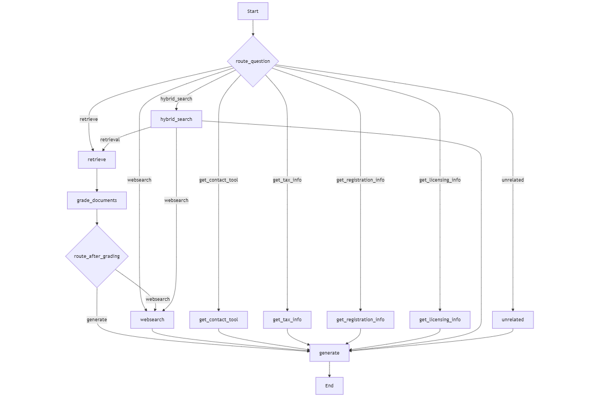

# Smart Business Guide 1.0

### Overview
The **Smart Business Guide 1.0** is an AI-powered solution for entrepreneurship and business planning in Finland, built on advanced **Agentic RAG** using LangChain and LangGraph frameworks. It uses advanced retrieval-augmented generation workflows to provide precise responses to user queries.

---

### Key Features

- **Authentic Information Retrieval**: Retrieves information from authentic business and entrepreneurship guides parsed using LlamaParse.

- **Dynamic Workflow Decisions**: Determines whether to use vector databases, web searches, or specialized tools based on query requirements, ensuring trusted and relevant results.

- **Retrieval Grading Mechanism**: Evaluates the relevancy of retrieved documents, deciding whether to proceed with the data or invoke a web search for additional information.

- **Answer Style Customization**: Provides flexibility to choose from three response styles:
  - **Concise**: Focused and brief answers.
  - **Moderate**: Balanced with some explanation.
  - **Explanatory**: Detailed with examples and illustrations.

- **Flexible Search Options**  
  - Internet-only search.
  - Hybrid search combining vector database results with internet queries.

- **Model Selection Flexibility**: Offers the ability to select:
  - Open-source models accessed via Groq Cloud API for lightning-fast responses.
  - OpenAI models for enhanced capabilities.
  Different LLMs can be assigned to specific nodes within the agentic workflow for tailored performance.

---

### How It Works
The Smart Guide integrates agentic AI workflows to dynamically:
1. Parse and retrieve data from pre-indexed guides.
2. Assess retrieved content for relevance.
3. Choose the most appropriate method (vector database, web search, or tools) to address the query.
4. Provide tailored responses based on user-selected answer styles.

---

### Use Case
Ideal for entrepreneurs, business owners, and professionals seeking actionable and reliable insights tailored to the Finnish business environment.

---
### Agentic workflow
<p align="center">
  
  <br>
  <em>The entire workflow of the application</em>
</p>  

---
### Streamlit App
<p align="center">
  
  <br>
  <em>A snapshot of the streamlit application</em>
</p>  

# How to Use the Code.
**Clone the repository:**
   ```
   git clone https://github.com/umairalipathan1980/Smart-Business-Guide-1.0.git
   cd Smart-Business-Guide-1.0
   ```
**Install the required libraries:**
   ```
   pip install -r requirements.txt
   ```
**Create a folder ".streamlit" in the root directory and create a "secrets.toml" file in it. Set your API keys there as follows:**
   ```
   GROQ_API_KEY = "your_GROQ_api_key" # get a free Groq API key from Groq Cloud
   TAVILY_API_KEY = "your_Tavily_api_key" # get a free Tavily API key
   LANGCHAIN_API_KEY = "your_LangChain_API_key" # get a free API key from LangSmith
   OPENAI_API_KEY = "your_OpenAI_API_KEY" # (optional) for OpenAI models
   ```
